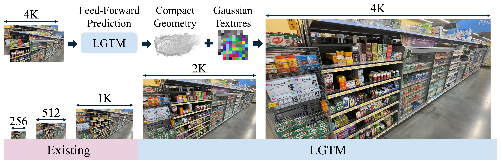

<h1> LGTM </h1>

<div id="user-content-toc" align="center">
  <ul style="list-style: none;">
    <summary><h2>Less Gaussians, Texture More: 4K Feed-Forward Textured Splatting</h2></summary>
  </ul>
</div>

<p align="center">
  <a href="https://yxlao.github.io/">Yixing Lao</a><sup>1,2&dagger;</sup>,
  <a href="https://xuyangbai.github.io/">Xuyang Bai</a><sup>2</sup>,
  <a href="https://xywu.me/">Xiaoyang Wu</a><sup>1</sup>,
  <a href="https://openreview.net/profile?id=~Nuoyuan_Yan1">Nuoyuan Yan</a><sup>2</sup>,
  <a href="https://lzx551402.github.io/">Zixin Luo</a><sup>2</sup>,
  <a href="https://scholar.google.com/citations?user=CtpU8mUAAAAJ">Tian Fang</a><sup>2</sup>,<br>
  <a href="https://www.linkedin.com/in/jnahmias">Jean-Daniel Nahmias</a><sup>2</sup>,
  <a href="https://scholar.google.com/citations?user=pa09Db8AAAAJ">Yanghai Tsin</a><sup>2</sup>,
  <a href="https://scholar.google.com/citations?user=YR1MdT0AAAAJ">Shiwei Li</a><sup>2&Dagger;</sup>,
  <a href="https://hszhao.github.io/">Hengshuang Zhao</a><sup>1</sup>
</p>

<p align="center">
  <sup>1</sup>HKU &nbsp;&nbsp; <sup>2</sup>Apple<br>
  <sup>&dagger;</sup>Work done during an internship at Apple &nbsp;&nbsp; <sup>&Dagger;</sup>Project lead
</p>

<p align="center">ICLR 2026</p>

<p align="center">
  <a href="https://arxiv.org/abs/2603.25745">Paper (PDF)</a> |
  <a href="https://apple.github.io/ml-lgtm/">Samples Page</a>
</p>

<p align="center">
  <picture>
    <source media="(prefers-color-scheme: dark)" srcset="docs/lgtm_teaser_dark.jpg">
    <source media="(prefers-color-scheme: light)" srcset="docs/lgtm_teaser.jpg">
    
  </picture>
</p>

Existing feed-forward Gaussian Splatting methods can't scale to 4K. **LGTM**
is the first native 4K feed-forward method that predicts compact textured
Gaussians.

---

## Installation

```bash
# Follow uv installation guides
# https://docs.astral.sh/uv/getting-started/installation/
curl -LsSf https://astral.sh/uv/install.sh | sh

# Clone the repository
git clone https://github.com/apple/ml-lgtm.git
cd ml-lgtm

# Install lgtm (editable) and dependencies (regular)
# This creates .venv/ automatically
uv sync
source .venv/bin/activate

# Clone, patch, and install gsplat with lgtm support
# LGTM implements custom textured 2DGS for gsplat
./scripts/clone_patch_gsplat.sh
uv pip install extern/gsplat/ --no-build-isolation
```

If you need a specific CUDA version, override after the `uv sync` step, e.g.,:

```bash
uv pip install torch torchvision torchaudio --index-url https://download.pytorch.org/whl/cu124
```

---

## Inference

The inference scripts download a test scene from the gated
[DL3DV-Benchmark](https://huggingface.co/datasets/DL3DV/DL3DV-Benchmark)
HuggingFace dataset. Before running them, accept the dataset license on the
linked page and log in:

```bash
hf auth login
```

The inference scripts will load LGTM Lightning checkpoints from `weights/` and
run feed-forward reconstruction on example images. Make sure you have downloaded
the weights:

```
wget -P weights \
  https://ml-site.cdn-apple.com/models/lgtm/dl3dv_depthsplat_lgtm_512x960_2048x3840.ckpt \
  https://ml-site.cdn-apple.com/models/lgtm/dl3dv_flash3d_lgtm_288x512_2304x4096.ckpt \
  https://ml-site.cdn-apple.com/models/lgtm/dl3dv_noposplat_lgtm_288x512_2304x4096.ckpt
```

Now, run the inference scripts:

```bash
python examples/inference_depthsplat.py
python examples/inference_noposplat.py
python examples/inference_flash3d.py
```

This will render the target views and interpolation videos, along with the
context images and target ground truth. You shall get something like:

```
examples/outputs_lgtm_depthsplat
|-- context_0.png
|-- context_9.png
|-- interpolation.mp4
|-- target_gt_1.png
|-- target_gt_3.png
|-- target_gt_5.png
|-- target_gt_7.png
|-- target_pd_1.png
|-- target_pd_3.png
|-- target_pd_5.png
`-- target_pd_7.png
```

---

## Training

### Datasets

For training, we support [DL3DV](https://github.com/DL3DV-10K/Dataset) dataset. We provide data
processing scripts to convert the original datasets to PyTorch chunk files
which can be directly loaded with this codebase. Please refer to
[docs/DATASETS.md](docs/DATASETS.md) for more details.

### Backbone Weights

Download backbone pretrained weights (required for training):

```bash
python scripts/download_pretrained.py
```

You shall get:

```
pretrained/
|-- MASt3R_ViTLarge_BaseDecoder_512_catmlpdpt_metric.pth            # For NoPoSplat
|-- depthsplat-gs-base-re10kdl3dv-448x768-randview2-6-f8ddd845.pth  # For DepthSplat
`-- unidepth-v1-vitl14.bin                                          # For Flash3D
```

By using backbone weights, you agree to comply with the licenses of NoPoSplat,
DepthSplat, and Flash3D, along with their associated dependencies, including but
not limited to: MASt3R, UniDepth, and UniMatch. See `src/lgtm/model/backbone`
for more details of the backbone implementations.

### Training Steps

**NoPoSplat LGTM**:

```bash
# Stage 1: 2DGS
python main.py +experiment=dl3dv_noposplat_2dgs_288x512_2304x4096
# Stage 2: BBSplat (no texture projection)
python main.py +experiment=dl3dv_noposplat_bbsplat_288x512_2304x4096
# Stage 3: LGTM
python main.py +experiment=dl3dv_noposplat_lgtm_288x512_2304x4096
```

**DepthSplat LGTM**:

```bash
# Stage 1: 2DGS
python main.py +experiment=dl3dv_depthsplat_2dgs_512x960_2048x3840
# Stage 2: LGTM
python main.py +experiment=dl3dv_depthsplat_lgtm_512x960_2048x3840
```

**Flash3D LGTM**:

```bash
# Stage 1: 2DGS
python main.py +experiment=dl3dv_flash3d_2dgs_288x512_2304x4096
# Stage 2: LGTM
python main.py +experiment=dl3dv_flash3d_lgtm_288x512_2304x4096
```

---

## Evaluation

Prepare the test [dataset](docs/DATASETS.md) in `data/dl3dv/` directory:

```
data/dl3dv/test/
|-- 000000.torch
|-- 000001.torch
|-- ...
`-- index.json
```

Download the weights to `weights/` directory:

```
wget -P weights \
  https://ml-site.cdn-apple.com/models/lgtm/dl3dv_depthsplat_lgtm_512x960_2048x3840.ckpt \
  https://ml-site.cdn-apple.com/models/lgtm/dl3dv_flash3d_lgtm_288x512_2304x4096.ckpt \
  https://ml-site.cdn-apple.com/models/lgtm/dl3dv_noposplat_lgtm_288x512_2304x4096.ckpt
```

Run evaluation on the test set using the weights:

```bash
# NoPoSplat LGTM
python main.py +experiment=dl3dv_noposplat_lgtm_288x512_2304x4096 mode=test wandb.mode=disabled \
    checkpointing.test_ckpt_path=weights/dl3dv_noposplat_lgtm_288x512_2304x4096.ckpt

# DepthSplat LGTM
python main.py +experiment=dl3dv_depthsplat_lgtm_512x960_2048x3840 mode=test wandb.mode=disabled \
    checkpointing.test_ckpt_path=weights/dl3dv_depthsplat_lgtm_512x960_2048x3840.ckpt

# Flash3D LGTM
python main.py +experiment=dl3dv_flash3d_lgtm_288x512_2304x4096 mode=test wandb.mode=disabled \
    checkpointing.test_ckpt_path=weights/dl3dv_flash3d_lgtm_288x512_2304x4096.ckpt
```

---

## Citation

```bibtex
@inproceedings{lao2026lgtm,
  title     = {Less Gaussians, Texture More: 4K Feed-Forward Textured Splatting},
  author    = {Lao, Yixing and Bai, Xuyang and Wu, Xiaoyang and Yan, Nuoyuan and Luo, Zixin and Fang, Tian and Nahmias, Jean-Daniel and Tsin, Yanghai and Li, Shiwei and Zhao, Hengshuang},
  booktitle = {ICLR},
  year      = {2026},
}
```

## License

Please check out the repository [LICENSE](LICENSE) before using the provided code and
[LICENSE_MODEL](LICENSE_MODEL) for the released models.